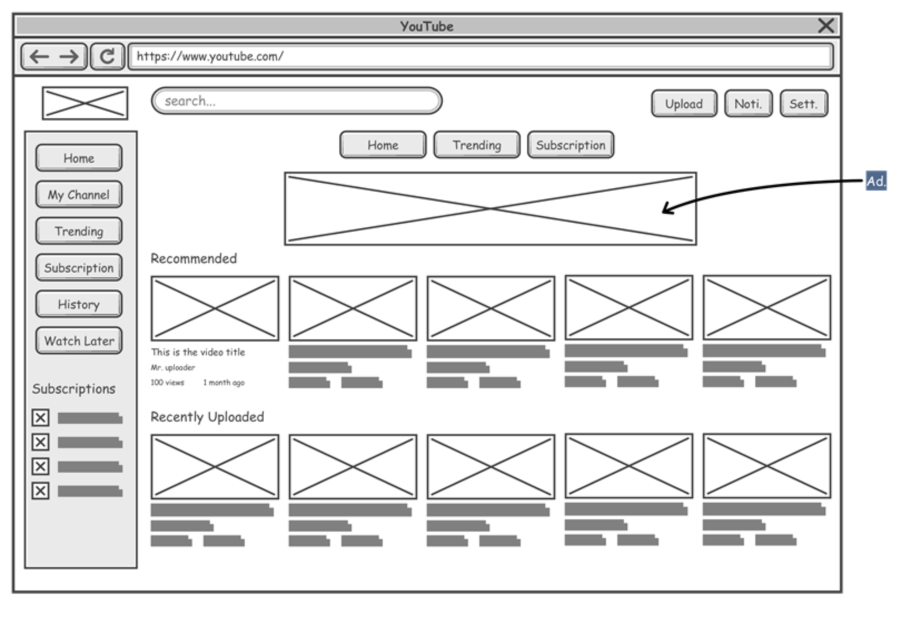

# Module 4: Designing a Website

- [Module 4: Designing a Website](#module-4-designing-a-website)
  - [Personas and User Journeys](#personas-and-user-journeys)
    - [Example Persona](#example-persona)
    - [Example User Journey (Given-When-Then)](#example-user-journey-given-when-then)
  - [Designer Role](#designer-role)
  - [Layouts for Different Types of Websites](#layouts-for-different-types-of-websites)
    - [Blog](#blog)
    - [Online Shop (E-commerce)](#online-shop-e-commerce)
    - [Portfolio](#portfolio)
  - [Wireframes](#wireframes)
  - [Design with Figma](#design-with-figma)
  - [Validating Design with A/B Testing](#validating-design-with-ab-testing)
  - [Usability Heuristics](#usability-heuristics)

Now that you know the basics of HTML and CSS, it’s time to think about how websites are planned and designed before any code is written. Here are some key concepts and roles involved in the design process:

---
## Personas and User Journeys

- **Personas** are imaginary users that represent different types of people who might use your website.
- Creating personas helps you think about your users’ needs, goals, and challenges.
- **User journeys** map out the steps a user might take to accomplish something on your site (like signing up or finding information).
- Thinking about personas and user journeys helps you design a site that works well for real people without adding not needed functionality

### Example Persona

**Name:** Sarah  
**Age:** 38  
**Occupation:** Office Manager  
**Tech Comfort Level:** Moderate  
**Goals:**  
- Quickly find and purchase office supplies online  
- Compare products and prices easily  
- Complete her order efficiently from her laptop or phone

**Challenges:**  
- Limited time to browse  
- Needs clear navigation and fast search results  
- Prefers a simple, secure checkout process

---

### Example User Journey (Given-When-Then)

**Goal:** Find and purchase a product on an e-commerce website

**Given** Sarah needs to buy printer paper for her office,  
**When** she visits the e-commerce homepage,  
**Then** she sees a search bar and product categories.

**Given** Sarah wants to find printer paper,  
**When** she types "printer paper" into the search bar and presses enter,  
**Then** the website displays a list of relevant products.

**Given** Sarah sees a product that looks suitable,  
**When** she clicks on the product name or image,  
**Then** she is taken to a detailed product page with price, description, and reviews.

**Given** Sarah decides to buy the product,  
**When** she clicks the "Add to Basket" button,  
**Then** the product is added to her shopping basket and she sees a confirmation.

**Given** Sarah is ready to check out,  
**When** she clicks on the basket icon and proceeds to checkout,  
**Then** she can review her order and complete the purchase quickly and

---

## Designer Role

- A **designer** focuses on how a website looks and feels.
- They create layouts, choose colours and fonts, and make sure the site is visually appealing and easy to use.
- Designers often work closely with developers to turn their ideas into real web pages.

---

## Layouts for Different Types of Websites

Different types of websites often use different layouts to best serve their users and content. Here are some common examples:

### Blog

- **Header** with site title or logo and navigation
- **Main content area** for blog posts (often in a single column)
- **Sidebar** for categories, recent posts, or social links
- **Footer** with copyright and additional links

### Online Shop (E-commerce)

- **Header** with logo, navigation, and shopping cart icon
- **Product grid/list** on the homepage or category pages
- **Filters** to sort or narrow down products
- **Product detail pages** with images, descriptions, price, and "Add to Cart" button
- **Checkout flow** for reviewing and purchasing items
- **Footer** with contact info, policies, and links

### Portfolio

- **Header** with name/logo and navigation
- **Hero section** with a short introduction or featured work
- **Gallery** to show images of projects

---

## Wireframes

- **Wireframes** are simple sketches or diagrams that show the basic structure of a web page.
- They help you plan where things like menus, images, and buttons will go—without worrying about colours or details yet.
- Wireframes can be drawn on paper or created with digital tools.

Example:  

---

## Design with Figma

- **Figma** is a popular online tool for designing websites and creating wireframes.
- It lets you experiment with layouts, colours, and fonts before you start coding.
- Figma is collaborative, so you can work with others and get feedback easily.
- Registration is free

Example:  

---

## Validating Design with A/B Testing

- **A/B testing** is a method for comparing two versions of a web page or feature to see which one performs better.
- You show version A to some users and version B to others, then measure which version helps users achieve a goal (like clicking a button or signing up).
- This helps you make decisions based on real user data, not just opinions.
- A/B testing is useful for testing things like button colours, headlines, layouts, or images.
- Tools like Google Optimize or Optimizely can help you run A/B tests on your website.

Example:  
You want to know if a green "Sign Up" button gets more clicks than a blue one. You create two versions of your page—one with each button colour—and see which gets more sign-ups.

---

## Usability Heuristics

- **Usability heuristics** are general rules for making websites easy to use.
- Examples include:  
  - Make things clear and consistent  
  - Give feedback when users do something  
  - Make important actions easy to find  
  - Prevent errors and help users recover from mistakes
- Following these guidelines helps create a better experience for everyone.
- List of [10 usability heuristics written in 1994](https://www.nngroup.com/articles/ten-usability-heuristics/) 
---

