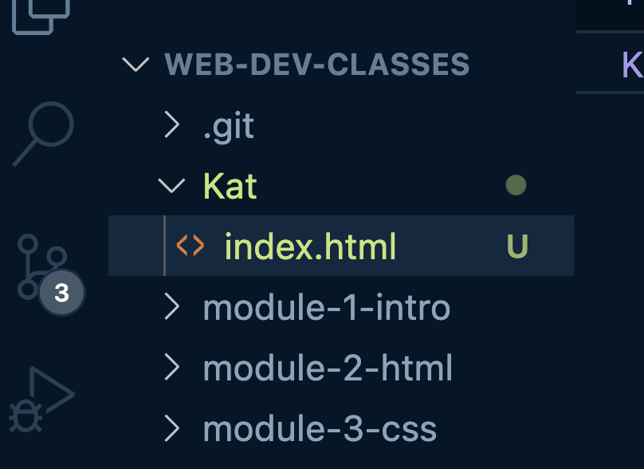

# Git for beginners — VS Code GUI workflow

## Quick checklist

- [ ] Install VS Code
- [ ] Install recommended extensions (GitHub Pull Requests and Issues; optional: GitHub Repositories, GitLens)
- [ ] (Optional) Install Git or accept VS Code's prompt to install command line tools
- [ ] Clone the repository using VS Code GUI
- [ ] Open the repo in VS Code and use the Source Control view to Pull updates

---

## 1 — Prerequisites

- VS Code installed. Download: https://code.visualstudio.com/
- Git: VS Code will prompt to install Git command line tools if needed.

Notes: For read-only cloning and pulling from public repositories the GitHub extensions can often handle everything without extra setup. Installing Git makes the experience more reliable.

## 2 — Install recommended extensions (one-time)

1. Open VS Code → Extensions (left sidebar).
2. Search and install:
	- **GitHub Pull Requests and Issues** (official)
	- Optional: **GitHub Repositories** (open repo remotely without cloning)
	- Optional: **GitLens** (helps visualise history)

Signing in to GitHub (optional but helpful)
- Click the Accounts icon (bottom-left) → `Sign in to GitHub` → follow the browser flow. This grants nicer integration but is not required for pulling from this public repo.

## 3 — Clone the repository (GUI; no terminal)

Option A — Recommended (local clone):

1. Command Palette: Cmd+Shift+P → type `Git: Clone` → press Enter.
2. Paste the HTTPS repo URL: `https://github.com/KatKmiotek/web_dev_classes.git` and press Enter.
3. Choose a folder on your computer to save the project.
4. Once cloning finishes, VS Code shows a notification — click **Open** to open the cloned folder.

Option B — Open remote without cloning (read-only):

1. Command Palette → `GitHub: Open Remote Repository...` → enter `KatKmiotek/web_dev_classes` → choose **Open**. This opens the repo in a virtual workspace (no local copy required).

## 4 — Pull updates (GUI)

With the repository open in VS Code:

- Open the Source Control view (left bar) or click the branch/status area in the bottom-left.
- Click the `...` menu in Source Control → choose **Pull** (or **Pull from...** and select `origin/main`).
- Alternatively, click the circular sync icon in the status bar (pulls + pushes).

Command palette alternative: Cmd+Shift+P → `Git: Pull`.

## 5 — Save your work (important)

For now we are using version control for keeping your local version of notes updated with version in GitHub.  
Please try to not edit files but maybe create your folder and keep your work there, it can be copy of module folder.  

Please don't worry if then you will see your work files highlighted and number in the left nav changing. This indicates those are changed files.  

